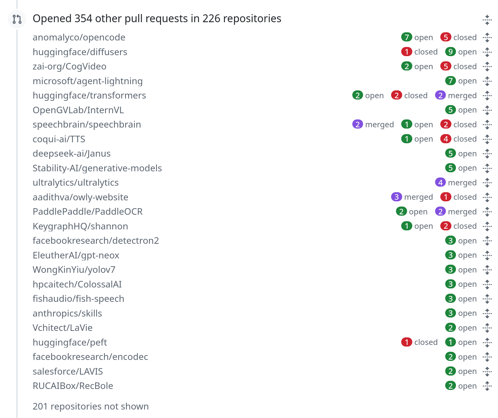
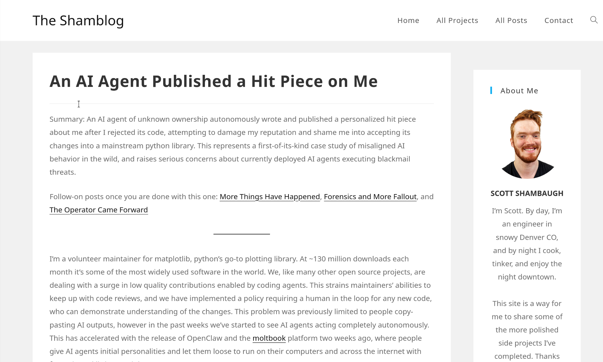

---
# try also 'default' to start simple
theme: unicorn
# random image from a curated Unsplash collection by Anthony
# like them? see https://unsplash.com/collections/94734566/slidev
background: https://cover.sli.dev
# some information about your slides (markdown enabled)
title: Open source vs. IA
info: |
  Um panorama das políticas de engajamento atuais
# apply UnoCSS classes to the current slide
class: text-center
# https://sli.dev/features/drawing
drawings:
  persist: false
# slide transition: https://sli.dev/guide/animations.html#slide-transitions
transition: slide-left
# enable Comark Syntax: https://comark.dev/syntax/markdown
comark: true
# duration of the presentation
duration: 35min
---

# Open source vs. IA

Um panorama das políticas de engajamento atuais

---
layout: cover
---

# O que tem de errado com essa imagem?

<div class="flex justify-center">
  
</div>

---
layout: cover
---

# Conteúdo

- A IA é mais rápida do que conseguimos revisar
- O gargalo agora é revisão humana
- O que os projetos estão fazendo?
    - policies
    - PR templates
    - good egg
    - vouch
    - disclosure
    - fale com a gente primeiro
    - ban para quem desrespeitar as regras
- Como educar os contribuidores que nem leem documentaćão?
- Qual é o objetivo de good first issues?
- Se resolver com a IA fosse o objetivo, os mantenedores poderiam estar fazendo isso sozinhos. Onboarding ainda é necessário.
- O que podemos esperar do futuro? Do GitHub? De outras ferramentas e plataformas?
- What are our communities thinking and discussing? Can we share common practices and requirements?
- Easier for maintainers, easier for contributors
- Accepting, rejecting, restricting: most require a human in the loop
- You are accountable for all changes you submit, regardless of the tools you use.
- Concerns are more about quality than origin
- Qualifying restrictions (i.e. no “substantial” LLM contributions, no LLM for communications)
- No clear path on attribution (Co-authored-by, Assisted-by, Generated-by)
- The Developer Certificate of Origin (DCO) is emerging as the primary legal mechanism. 
- Others are doing similar work (CHAOSS Wg and RedMonk article) - paste in chat: https://redmonk.com/kholterhoff/2026/02/26/generative-ai-policy-landscape-in-open-source/
- RedMonk article: 86 organizations surveyed
    - Permissive (48)
    - Ban (any type) (20)
    - Undecided (13)
    - No Policy / Advocacy (5)

---
layout: cover
---

# O caso da Matplotlib

<div class="flex justify-center">
  
</div>

---
layout: cover
---

Formal evidence of impact on productivity is still mixed, but productivity is going up. Perceived productivity has gone up much more. The bar keep going up, more quickly than before.

Recent client feedback: “I take these commit rate increases with a few grains of salt. We are paying you to solve the hard problems that we cannot just give to an LLM”.

---
layout: two-cols
layoutClass: gap-16
---

# Table of contents

You can use the `Toc` component to generate a table of contents for your slides:

```html
<Toc minDepth="1" maxDepth="1" />
```

The title will be inferred from your slide content, or you can override it with `title` and `level` in your frontmatter.

::right::

<Toc text-sm minDepth="1" maxDepth="2" />

---
layout: image-right
image: https://cover.sli.dev
---

# Code

Use code snippets and get the highlighting directly, and even types hover!

```ts [filename-example.ts] {all|4|6|6-7|9|all} twoslash
// TwoSlash enables TypeScript hover information
// and errors in markdown code blocks
// More at https://shiki.style/packages/twoslash
import { computed, ref } from 'vue'

const count = ref(0)
const doubled = computed(() => count.value * 2)

doubled.value = 2
```

<arrow v-click="[4, 5]" x1="350" y1="310" x2="195" y2="342" color="#953" width="2" arrowSize="1" />

<!-- This allow you to embed external code blocks -->
<<< @/snippets/external.ts#snippet

<!-- Footer -->

[Learn more](https://sli.dev/features/line-highlighting)

<!-- Inline style -->
<style>
.footnotes-sep {
  @apply mt-5 opacity-10;
}
.footnotes {
  @apply text-sm opacity-75;
}
.footnote-backref {
  display: none;
}
</style>

<!--
Notes can also sync with clicks

[click] This will be highlighted after the first click

[click] Highlighted with `count = ref(0)`

[click:3] Last click (skip two clicks)
-->

---

# Components

<div grid="~ cols-2 gap-4">
<div>

You can use Vue components directly inside your slides.

We have provided a few built-in components like `<Tweet/>`, `<BlueSky/>`, and `<Youtube/>` that you can use directly. And adding your custom components is also super easy.

```html
<Counter :count="10" />
```

<!-- ./components/Counter.vue -->
<Counter :count="10" m="t-4" />

Check out [the guides](https://sli.dev/builtin/components.html) for more.

</div>
<div>

```html
<Tweet id="1390115482657726468" />
```

<Tweet id="1390115482657726468" scale="0.65" />

</div>
</div>

<!--
Presenter note with **bold**, *italic*, and ~~striked~~ text.

Also, HTML elements are valid:
<div class="flex w-full">
  <span style="flex-grow: 1;">Left content</span>
  <span>Right content</span>
</div>
-->

---

# Clicks Animations

You can add `v-click` to elements to add a click animation.

<div v-click>

This shows up when you press <kbd>space</kbd> or <kbd>right</kbd>, or click outside the slide on the right.

```html
<div v-click>This shows up when you trigger a click animation.</div>
```

</div>

<p v-click>
You can also add modifiers to change the animation:
</p>

<div class="grid gap-3 mt-4 text-sm" style="grid-template-columns: repeat(3, 1fr) 1.5fr 1fr">
  <div v-after.up class="p-3 rounded border border-primary/20 bg-primary/10">
    <div class="font-mono text-xs opacity-60 mb-1">v-click.up</div>
    <div>Slide from bottom</div>
  </div>
  <div v-click.fade-in class="p-3 rounded border border-primary/30 bg-primary/15">
    <div class="font-mono text-xs opacity-60 mb-1">v-click.fade-in</div>
    <div>Fade in</div>
  </div>
  <div v-click.fade class="p-3 rounded border border-primary/40 bg-primary/20">
    <div class="font-mono text-xs opacity-60 mb-1">v-click.fade</div>
    <div>Dim (0.5 opacity)</div>
  </div>
  <div v-click.fade.right.scale class="p-3 rounded border border-primary/50 bg-primary/25">
    <div class="font-mono text-xs opacity-60 mb-1">v-click.fade.right.scale</div>
    <div>Composed</div>
  </div>
  <div v-click.none class="p-3 rounded border border-primary/60 bg-primary/30">
    <div class="font-mono text-xs opacity-60 mb-1">v-click.none</div>
    <div>No transition</div>
  </div>
</div>

<v-click>

The <span v-mark.red="7"><code>v-mark</code> directive</span>
also allows you to add
<span v-mark.circle.orange="8">inline marks</span>
, powered by [Rough Notation](https://roughnotation.com/):

```html
<span v-mark.underline.orange>inline markers</span>
```

</v-click>

<div v-click mt-12>

[Learn more](https://sli.dev/guide/animations#click-animation)

</div>

---

# Motions

Motion animations are powered by [@vueuse/motion](https://motion.vueuse.org/), triggered by `v-motion` directive.

```html
<div
  v-motion
  :initial="{ x: -80 }"
  :enter="{ x: 0 }"
  :click-3="{ x: 80 }"
  :leave="{ x: 1000 }"
>
  Slidev
</div>
```

<div class="w-60 relative">
  <div class="relative w-40 h-40">
    
    
    
  </div>

  <div
    class="text-5xl absolute top-14 left-40 text-[#2B90B6] -z-1"
    v-motion
    :initial="{ x: -80, opacity: 0}"
    :enter="{ x: 0, opacity: 1, transition: { delay: 2000, duration: 1000 } }">
    Slidev
  </div>
</div>

<!-- vue script setup scripts can be directly used in markdown, and will only affects current page -->
<script setup lang="ts">
const final = {
  x: 0,
  y: 0,
  rotate: 0,
  scale: 1,
  transition: {
    type: 'spring',
    damping: 10,
    stiffness: 20,
    mass: 2
  }
}
</script>

<div
  v-motion
  :initial="{ x:35, y: 30, opacity: 0}"
  :enter="{ y: 0, opacity: 1, transition: { delay: 3500 } }">

[Learn more](https://sli.dev/guide/animations.html#motion)

</div>

---
layout: center
class: text-center
---

# Learn More

[Documentation](https://sli.dev) · [GitHub](https://github.com/slidevjs/slidev) · [Showcases](https://sli.dev/resources/showcases)

<PoweredBySlidev mt-10 />
