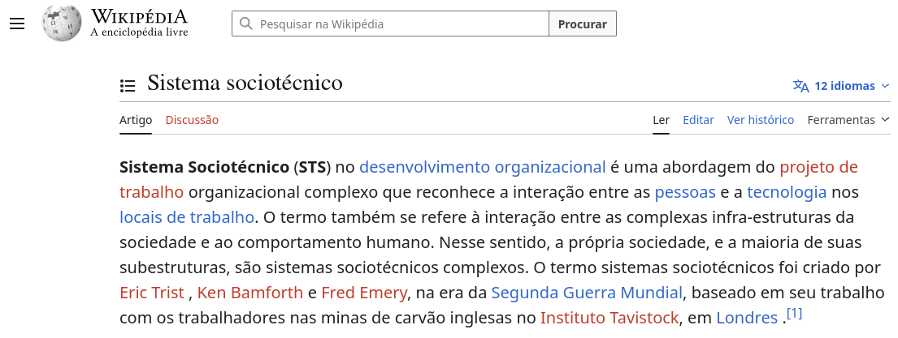
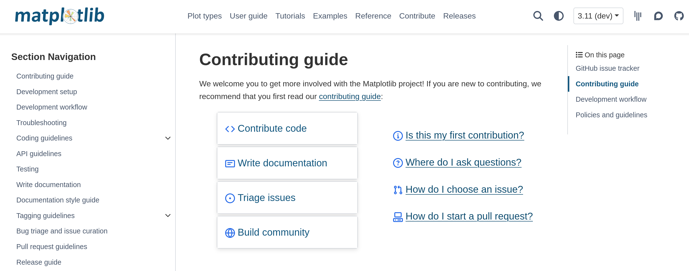
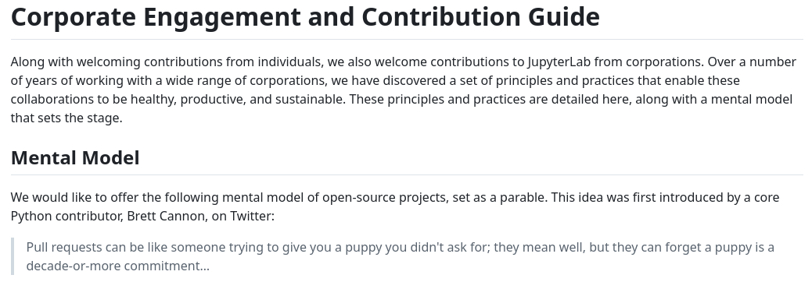
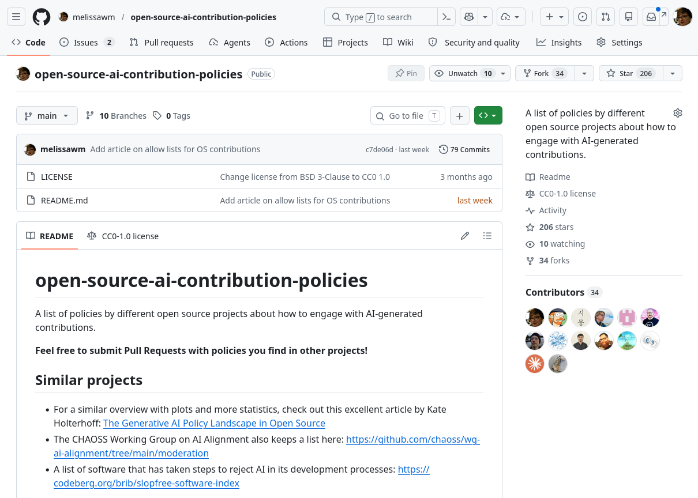
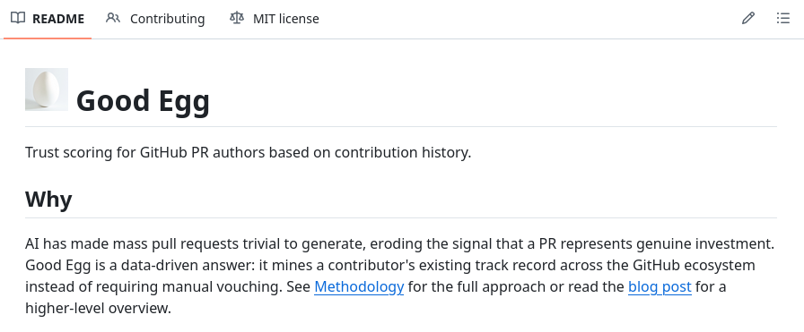
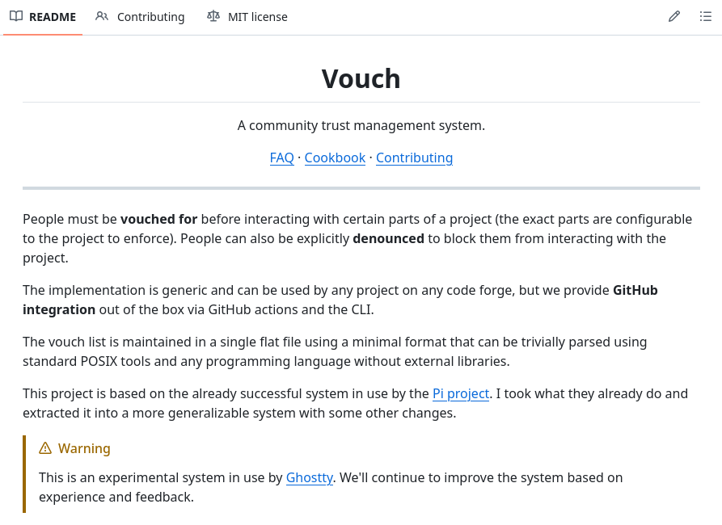
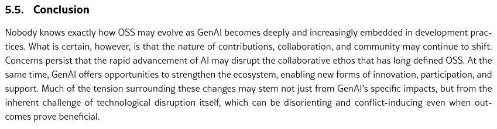

---
# try also 'default' to start simple
theme: unicorn
# random image from a curated Unsplash collection by Anthony
# like them? see https://unsplash.com/collections/94734566/slidev
background: https://cover.sli.dev
# some information about your slides (markdown enabled)
title: Open source vs. IA
info: |
  Um panorama das políticas de engajamento atuais
# apply UnoCSS classes to the current slide
class: text-center
# https://sli.dev/features/drawing
drawings:
  persist: false
# slide transition: https://sli.dev/guide/animations.html#slide-transitions
transition: slide-left
# enable Comark Syntax: https://comark.dev/syntax/markdown
comark: true
# duration of the presentation
duration: 30min
---

# Open source vs. IA

Um panorama das políticas de engajamento atuais

---
layout: cover
---

# O que tem de errado com essa imagem?

  

---

# O que é Open Source?

  

---

# Contrato social

  

---

# O que é uma contribuição?

  

---
layout: image-right
image: ./images/qc.gif
---

# Velocidade

<ul>
  <li>A IA é mais rápida do que conseguimos revisar</li>
  <li>O gargalo agora é revisão humana</li>
</ul>

---

# O caso da Matplotlib

  

---

# O que os projetos estão fazendo?

<!-- What are our communities thinking and discussing? Can we share common practices and requirements? -->

- Orientar mantenedores e contribuidores
- Acertar expectativas
- Templates para PR, declaração de autoria
- "Interaja com o projeto primeiro"
- Ban para quem desrespeitar as regras

<h2 class="text-center">
Regras/<i>policies</i>
</h2>

---

# Regras

  

---

# Regras

- 113 projetos; 38 rejeitam uso de IA.
- Quase todos exigem intervenção humana (contribuições totalmente automatizadas são proibidas)
- Não importa a ferramenta usada, você é responsável
- A preocupação é mais com qualidade do que com a origem da contribuição
- Restrições qualificadoras (ou seja, sem contribuições substanciais de LLM, sem LLM para comunicação, etc.)
- Não há consenso sobre atribuição (Co-authored-by, Assisted-by, Generated-by)
- O [Certificado de Origem do Desenvolvedor (DCO)](https://en.wikipedia.org/wiki/Developer_Certificate_of_Origin) está emergindo como um mecanismo legal para copyright

## Outras listas

- CHAOSS Working Group on AI Alignment
- Artigo da RedMonk: https://redmonk.com/kholterhoff/2026/02/26/generative-ai-policy-landscape-in-open-source/

---

# Como educar os contribuidores que nem leem documentação?

- Qual é o objetivo de _good first issues_?
- Se resolver com a IA fosse o objetivo, os mantenedores poderiam estar fazendo isso sozinhos.
- Sustentabilidade: onboarding ainda é necessário.

---

# Produtividade e Contributor Experience

_"We are paying you to solve the hard problems that we cannot just give to an LLM"_

- Qual é o nosso papel como mantenedores?
- Uso extrativo das ferramentas de IA é um problema
- Como ajudar mantenedores?

---

# Good Egg

  

---

# Vouch

  

---

# Pra onde estamos indo?

<!-- O que podemos esperar do futuro? Do GitHub? De outras ferramentas e plataformas? -->

  

https://arxiv.org/html/2508.04921v2

---
layout: center
class: text-center
---

# Obrigada!

melissawm@gmail.com | pynews.com.br/@melissawm | github.com/melissawm

<PoweredBySlidev mt-10 />
